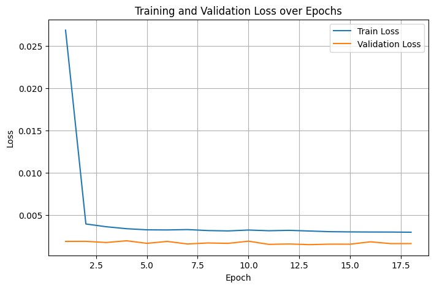

# SOC_toyproject
Author: Shiang Guo gshiang@zju.edu.cn
## 项目简介
这是一个电池状态（SOC）估计的深度学习示范项目，包含数据处理、模型训练和评估代码。
所有时序序列考虑非均匀间隔数据采样，并且不适用线性插值，选择时间增量Δt作为额外输入特征，避免绝对时间编码在长时预测中的梯度消失
## 项目结构
- `data/`：存放数据文件
- `notebooks/`：交互式分析笔记本
- `src/`：源代码
- `.gitignore`：Git忽略文件
- `requirements.txt`：依赖库列表

## 模型选择参考
🔄 多重视角下的SOC估计任务
层次	任务类型	对应建模方式
低层	监督回归	MLP, LSTM, CNN
中层	时序建模	LSTM, GRU, Transformer
高层	状态估计 / 潜变量感知	EKF, Particle Filter, RNN-ODE
更高	去噪与物理一致性	PINN, hybrid models

## 数据来源 
NASA 电池数据集（Battery Data Set）
该数据集包含锂离子电池在不同温度下的充放电实验数据，记录了阻抗作为损伤标准。

下载链接：https://phm-datasets.s3.amazonaws.com/NASA/5.+Battery+Data+Set.zip

数据集引用：Brad Bebout, Leslie Profert-Bebout, Erich Fleming, Angela Detweiler, and Kai Goebel “Battery Data Set”, NASA Prognostics Data Repository, NASA Ames Research Center, Moffett Field, CA 
scirp.org
+2
nasa.gov
+2
paperswithcode.com
+2

典型的充放电曲线：
1. S型放电：

2. CC-CV充电

3. 锂电池放电完成后极化电压消除，电压回升 温度回降


## 运行指南 
考虑四种模型 LSTM 1D-CNN LSTM+1D-CNN Transformer
LSTM： class BasicLSTM(nn.Module)

## __main__.py 文件架构 
1. 环境准备
   └─ 导入库 + 固定随机种子（numpy、torch、random）

2. 路径配置
   ├─ 设置原始数据、处理后数据、输出目录
   └─ 创建必要目录

3. 数据预处理
   ├─ batch_convert_mat_to_csv：.mat转.csv
   ├─ clean_soc_csv_files：清洗缺失和异常值
   ├─ load_all_clean_csvs：合并所有清洗数据
   └─ 查看样本数及文件列表

4. 数据划分
   ├─ 按电池Cycle划分，防止泄漏
   └─ 得到 train/val/test 三份数据

5. 特征标准化
   ├─ 训练集fit StandardScaler并保存
   ├─ 训练/验证/测试集分别transform
   └─ 替换原特征列为标准化结果

6. 构造 Dataset & DataLoader
   ├─ 使用 BatteryDatasetLSTM 按序列窗口构建数据集 **（更换模型重构数据集）**
   └─ 依据超参设置 batch_size 生成 DataLoader **（可以暂时不生成）**

7. 模型与优化器定义
   ├─ 使用 Basic1DCNN（或其他模型）**（自动以模型到mymodel.model.py）**
   ├─ 定义 Adam 优化器和 MSELoss
   └─ 模型发送到设备（CPU/GPU）**device = get_device()**

8. 超参数调优（Optuna）
   ├─ 定义调参目标函数 **objective(trial)**（模型、训练、验证、早停）
   ├─ 搜索卷积核数、层数、学习率等 **evaluate()**
   └─ 返回最优超参数 
        study = optuna.create_study(direction="minimize")
        study.optimize(objective, n_trials=20)
        print("Best trial params:")
        print(study.best_trial.params)

9. 用最优超参训练最终模型 **best_params = study.best_trial.params**
   ├─ 重建 Dataset & DataLoader
   ├─ 多轮训练，监控验证损失，早停策略 **criterion,optimizer train_one_epoch() evaluate()**
   └─ 保存最佳模型权重

10. 测试集评估
    ├─ 加载最佳模型
    └─ 计算并打印测试损失

11. 保存结果与日志
    ├─ 保存超参和测试损失文本
    └─ 保存训练/验证损失CSV

## 无optuna调试的结果_LSTM
总样本数: 1759498
涉及文件: ['B0005_soc_clean.csv' 'B0007_soc_clean.csv' 'B0006_soc_clean.csv']
Train set: 1205421, Val set: 287085, Test set: 266992
Using device: cuda
Epoch 1/10, Train Loss: 0.002524, Val Loss: 0.001606
Epoch 2/10, Train Loss: 0.001795, Val Loss: 0.001410
Epoch 3/10, Train Loss: 0.001577, Val Loss: 0.001555
Epoch 4/10, Train Loss: 0.001451, Val Loss: 0.001343
Epoch 5/10, Train Loss: 0.001359, Val Loss: 0.001377
Epoch 6/10, Train Loss: 0.001279, Val Loss: 0.001275
## optuna调试的结果_LSTM
最优参数：
Best Params: {'hidden_size': 75, 'num_layers': 2, 'dropout': 0.08703576427525062, 'lr': 0.001830995342196746, 'batch_size': 64}
Test Loss: 0.000618
Final training complete.

## 1DCNN 结果
最优参数：
Best Params: {'num_filters': 64, 'kernel_size': 7, 'num_layers': 2, 'stride': 3, 'dropout': 0.4966608032430354, 'pool_type': 'avg', 'lr': 0.00033782157845375167, 'batch_size': 128}
Test Loss: 0.001815
损失曲线：


## 环境依赖
请使用以下命令安装依赖：
```bash
pip install -r requirements.txt


