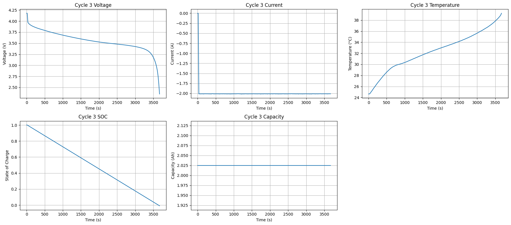
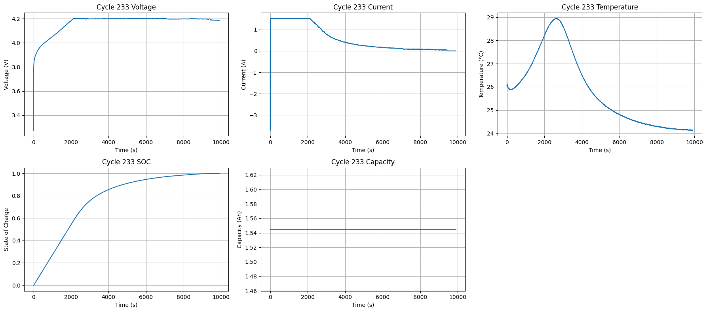

# SOC_toyproject
Author: Shiang Guo gshiang@zju.edu.cn
## 项目简介
这是一个电池状态（SOC）估计的深度学习示范项目，包含数据处理、模型训练和评估代码。
所有时序序列考虑非均匀间隔数据采样，并且不适用线性插值，选择时间增量Δt作为额外输入特征，避免绝对时间编码在长时预测中的梯度消失
## 项目结构
- `data/`：存放数据文件
- `notebooks/`：交互式分析笔记本
- `src/`：源代码
- `.gitignore`：Git忽略文件
- `requirements.txt`：依赖库列表

## 模型选择参考
🔄 多重视角下的SOC估计任务
层次	任务类型	对应建模方式
低层	监督回归	MLP, LSTM, CNN
中层	时序建模	LSTM, GRU, Transformer
高层	状态估计 / 潜变量感知	EKF, Particle Filter, RNN-ODE
更高	去噪与物理一致性	PINN, hybrid models

## 数据来源 
NASA 电池数据集（Battery Data Set）
该数据集包含锂离子电池在不同温度下的充放电实验数据，记录了阻抗作为损伤标准。

下载链接：https://phm-datasets.s3.amazonaws.com/NASA/5.+Battery+Data+Set.zip

数据集引用：Brad Bebout, Leslie Profert-Bebout, Erich Fleming, Angela Detweiler, and Kai Goebel “Battery Data Set”, NASA Prognostics Data Repository, NASA Ames Research Center, Moffett Field, CA 
scirp.org
+2
nasa.gov
+2
paperswithcode.com
+2

典型的充放电曲线：
1. S型放电：

2. CC-CV充电

3. 锂电池放电完成后极化电压消除，电压回升 温度回降


## 运行指南 
考虑四种模型 LSTM 1D-CNN LSTM+1D-CNN Transformer
LSTM： class BasicLSTM(nn.Module)


## __main__.py 文件架构 
        Step 1: 原始数据加载
                ↓
        Step 2: 按文件划分训练 / 验证 / 测试
                ↓
        Step 3: 用训练集 fit 标准化器 StandardScaler
                ↓
        Step 4: 分别 transform 三个子集
                ↓
        Step 5: 转为 Tensor
                ↓
        Step 6: 封装成 Dataset（带序列窗口）
                ↓
        Step 7: 封装成 DataLoader（可训练）
1. batch_convert_mat_to_csv（）实现data\raw\ .mat 到 .csv的转换，假如Delta time 和 SOC 的伪真值
2. clean_soc_csv_file （） 清洗NAN和去掉SOC不合理的值 得到data\procssed\ **soc_clean.csv
3. plot_voltage_soc_by_cycle() 可视化观察不同工况的 [V I SOC] with respect to time 
4. df = load_all_clean_csvs(processed_dir) 拼接文件 B0005,6,7 _soc_clean.csv
5. 

## 无optuna调试的结果_LSTM
总样本数: 1759498
涉及文件: ['B0005_soc_clean.csv' 'B0007_soc_clean.csv' 'B0006_soc_clean.csv']
Train set: 1205421, Val set: 287085, Test set: 266992
Using device: cuda
Epoch 1/10, Train Loss: 0.002524, Val Loss: 0.001606
Epoch 2/10, Train Loss: 0.001795, Val Loss: 0.001410
Epoch 3/10, Train Loss: 0.001577, Val Loss: 0.001555
Epoch 4/10, Train Loss: 0.001451, Val Loss: 0.001343
Epoch 5/10, Train Loss: 0.001359, Val Loss: 0.001377
Epoch 6/10, Train Loss: 0.001279, Val Loss: 0.001275
## optuna调试的结果_LSTM
最优参数：
Best Params: {'hidden_size': 75, 'num_layers': 2, 'dropout': 0.08703576427525062, 'lr': 0.001830995342196746, 'batch_size': 64}
Test Loss: 0.000618
Train set: 1205421, Val set: 287085, Test set: 266992
Using device: cuda

[I 2025-06-23 10:09:05,748] A new study created in memory with name: no-name-b66dd58d-477e-4e1e-a02e-6bd428316d68
[Trial 0] Epoch 1/20 - Train Loss: 0.002405, Val Loss: 0.001612
[Trial 0] Epoch 2/20 - Train Loss: 0.001826, Val Loss: 0.001680
[Trial 0] Epoch 3/20 - Train Loss: 0.001675, Val Loss: 0.001495
[Trial 0] Epoch 4/20 - Train Loss: 0.001573, Val Loss: 0.001788
[Trial 0] Epoch 5/20 - Train Loss: 0.001522, Val Loss: 0.001679
[Trial 0] Epoch 6/20 - Train Loss: 0.001471, Val Loss: 0.001505
Early stopping triggered at epoch 6 for trial 0
[I 2025-06-23 10:23:05,697] Trial 0 finished with value: 0.0014945323498225336 and parameters: {'hidden_size': 38, 'num_layers': 3, 'dropout': 0.27405328724957123, 'lr': 0.0012234664365582658, 'batch_size': 32}. Best is trial 0 with value: 0.0014945323498225336.
[Trial 1] Epoch 1/20 - Train Loss: 0.002413, Val Loss: 0.001476
[Trial 1] Epoch 2/20 - Train Loss: 0.001806, Val Loss: 0.001710
[Trial 1] Epoch 3/20 - Train Loss: 0.001626, Val Loss: 0.001356
[Trial 1] Epoch 4/20 - Train Loss: 0.001530, Val Loss: 0.001614
[Trial 1] Epoch 5/20 - Train Loss: 0.001452, Val Loss: 0.001370
[Trial 1] Epoch 6/20 - Train Loss: 0.001366, Val Loss: 0.001307
[Trial 1] Epoch 7/20 - Train Loss: 0.001273, Val Loss: 0.001373
[Trial 1] Epoch 8/20 - Train Loss: 0.001187, Val Loss: 0.001193
[Trial 1] Epoch 9/20 - Train Loss: 0.001100, Val Loss: 0.001193
[Trial 1] Epoch 10/20 - Train Loss: 0.001043, Val Loss: 0.001153
[Trial 1] Epoch 11/20 - Train Loss: 0.000995, Val Loss: 0.001196
[Trial 1] Epoch 12/20 - Train Loss: 0.000947, Val Loss: 0.000932
[Trial 1] Epoch 13/20 - Train Loss: 0.000913, Val Loss: 0.000941
[Trial 1] Epoch 14/20 - Train Loss: 0.000890, Val Loss: 0.000830
[Trial 1] Epoch 15/20 - Train Loss: 0.000882, Val Loss: 0.000885
[Trial 1] Epoch 16/20 - Train Loss: 0.000855, Val Loss: 0.001067
[Trial 1] Epoch 17/20 - Train Loss: 0.000843, Val Loss: 0.000967
Early stopping triggered at epoch 17 for trial 1
[I 2025-06-23 11:01:39,230] Trial 1 finished with value: 0.0008297175538430193 and parameters: {'hidden_size': 34, 'num_layers': 3, 'dropout': 0.2745034386983892, 'lr': 0.0010141038212999397, 'batch_size': 32}. Best is trial 1 with value: 0.0008297175538430193.
[Trial 2] Epoch 1/20 - Train Loss: 0.004632, Val Loss: 0.001789
[Trial 2] Epoch 2/20 - Train Loss: 0.001977, Val Loss: 0.001484
[Trial 2] Epoch 3/20 - Train Loss: 0.001712, Val Loss: 0.001642
[Trial 2] Epoch 4/20 - Train Loss: 0.001614, Val Loss: 0.001521
[Trial 2] Epoch 5/20 - Train Loss: 0.001517, Val Loss: 0.001461
[Trial 2] Epoch 6/20 - Train Loss: 0.001444, Val Loss: 0.001513
[Trial 2] Epoch 7/20 - Train Loss: 0.001394, Val Loss: 0.001434
[Trial 2] Epoch 8/20 - Train Loss: 0.001350, Val Loss: 0.001440
[Trial 2] Epoch 9/20 - Train Loss: 0.001317, Val Loss: 0.001394
[Trial 2] Epoch 10/20 - Train Loss: 0.001289, Val Loss: 0.001381
[Trial 2] Epoch 11/20 - Train Loss: 0.001260, Val Loss: 0.001331
[Trial 2] Epoch 12/20 - Train Loss: 0.001228, Val Loss: 0.001313
[Trial 2] Epoch 13/20 - Train Loss: 0.001211, Val Loss: 0.001377
[Trial 2] Epoch 14/20 - Train Loss: 0.001185, Val Loss: 0.001317
[Trial 2] Epoch 15/20 - Train Loss: 0.001165, Val Loss: 0.001380
Early stopping triggered at epoch 15 for trial 2
[I 2025-06-23 11:08:44,782] Trial 2 finished with value: 0.0013132598069060912 and parameters: {'hidden_size': 91, 'num_layers': 1, 'dropout': 0.027944668802685202, 'lr': 0.00029242149968423817, 'batch_size': 128}. Best is trial 1 with value: 0.0008297175538430193.
[Trial 3] Epoch 1/20 - Train Loss: 0.002407, Val Loss: 0.001572
[Trial 3] Epoch 2/20 - Train Loss: 0.001764, Val Loss: 0.001760
[Trial 3] Epoch 3/20 - Train Loss: 0.001582, Val Loss: 0.001620
[Trial 3] Epoch 4/20 - Train Loss: 0.001465, Val Loss: 0.001375
[Trial 3] Epoch 5/20 - Train Loss: 0.001375, Val Loss: 0.001245
[Trial 3] Epoch 6/20 - Train Loss: 0.001248, Val Loss: 0.001182
[Trial 3] Epoch 7/20 - Train Loss: 0.001121, Val Loss: 0.001142
[Trial 3] Epoch 8/20 - Train Loss: 0.001031, Val Loss: 0.001145
[Trial 3] Epoch 9/20 - Train Loss: 0.000949, Val Loss: 0.000946
[Trial 3] Epoch 10/20 - Train Loss: 0.000859, Val Loss: 0.000826
[Trial 3] Epoch 11/20 - Train Loss: 0.000797, Val Loss: 0.000871
[Trial 3] Epoch 12/20 - Train Loss: 0.000759, Val Loss: 0.000776
[Trial 3] Epoch 13/20 - Train Loss: 0.000734, Val Loss: 0.000777
[Trial 3] Epoch 14/20 - Train Loss: 0.000706, Val Loss: 0.000749
[Trial 3] Epoch 15/20 - Train Loss: 0.000692, Val Loss: 0.000706
[Trial 3] Epoch 16/20 - Train Loss: 0.000681, Val Loss: 0.000942
[Trial 3] Epoch 17/20 - Train Loss: 0.000664, Val Loss: 0.000690
[Trial 3] Epoch 18/20 - Train Loss: 0.000654, Val Loss: 0.000685
[Trial 3] Epoch 19/20 - Train Loss: 0.000645, Val Loss: 0.000692
[Trial 3] Epoch 20/20 - Train Loss: 0.000639, Val Loss: 0.000615
[I 2025-06-23 11:28:49,091] Trial 3 finished with value: 0.0006150198930500692 and parameters: {'hidden_size': 75, 'num_layers': 2, 'dropout': 0.08703576427525062, 'lr': 0.001830995342196746, 'batch_size': 64}. Best is trial 3 with value: 0.0006150198930500692.
[Trial 4] Epoch 1/20 - Train Loss: 0.002398, Val Loss: 0.001803
[Trial 4] Epoch 2/20 - Train Loss: 0.001866, Val Loss: 0.001851
[Trial 4] Epoch 3/20 - Train Loss: 0.001681, Val Loss: 0.001510
[Trial 4] Epoch 4/20 - Train Loss: 0.001566, Val Loss: 0.001543
[Trial 4] Epoch 5/20 - Train Loss: 0.001495, Val Loss: 0.001429
[Trial 4] Epoch 6/20 - Train Loss: 0.001446, Val Loss: 0.001575
[Trial 4] Epoch 7/20 - Train Loss: 0.001375, Val Loss: 0.001561
[Trial 4] Epoch 8/20 - Train Loss: 0.001501, Val Loss: 0.001609
Early stopping triggered at epoch 8 for trial 4
[I 2025-06-23 11:34:07,869] Trial 4 finished with value: 0.001429014992200767 and parameters: {'hidden_size': 54, 'num_layers': 3, 'dropout': 0.2634569878560016, 'lr': 0.004463756973394857, 'batch_size': 128}. Best is trial 3 with value: 0.0006150198930500692.
[Trial 5] Epoch 1/20 - Train Loss: 0.002190, Val Loss: 0.001670
Trial 5 pruned at epoch 1
[I 2025-06-23 11:35:56,040] Trial 5 pruned.
[Trial 6] Epoch 1/20 - Train Loss: 0.002542, Val Loss: 0.001576
[Trial 6] Epoch 2/20 - Train Loss: 0.001833, Val Loss: 0.001485
[Trial 6] Epoch 3/20 - Train Loss: 0.001654, Val Loss: 0.001642
[Trial 6] Epoch 4/20 - Train Loss: 0.001548, Val Loss: 0.001437
[Trial 6] Epoch 5/20 - Train Loss: 0.001490, Val Loss: 0.001751
Trial 6 pruned at epoch 5
[I 2025-06-23 11:39:24,380] Trial 6 pruned.
[Trial 7] Epoch 1/20 - Train Loss: 0.003034, Val Loss: 0.001783
Trial 7 pruned at epoch 1
[I 2025-06-23 11:41:33,121] Trial 7 pruned.
[Trial 8] Epoch 1/20 - Train Loss: 0.002234, Val Loss: 0.002946
Trial 8 pruned at epoch 1
[I 2025-06-23 11:43:16,043] Trial 8 pruned.
[Trial 9] Epoch 1/20 - Train Loss: 0.002257, Val Loss: 0.001527
[Trial 9] Epoch 2/20 - Train Loss: 0.001731, Val Loss: 0.001495
[Trial 9] Epoch 3/20 - Train Loss: 0.001418, Val Loss: 0.001094
[Trial 9] Epoch 4/20 - Train Loss: 0.001101, Val Loss: 0.000989
[Trial 9] Epoch 5/20 - Train Loss: 0.000959, Val Loss: 0.000890
[Trial 9] Epoch 6/20 - Train Loss: 0.000902, Val Loss: 0.000904
[Trial 9] Epoch 7/20 - Train Loss: 0.000871, Val Loss: 0.000844
[Trial 9] Epoch 8/20 - Train Loss: 0.000828, Val Loss: 0.001008
[Trial 9] Epoch 9/20 - Train Loss: 0.000794, Val Loss: 0.000753
[Trial 9] Epoch 10/20 - Train Loss: 0.000825, Val Loss: 0.000779
[Trial 9] Epoch 11/20 - Train Loss: 0.000771, Val Loss: 0.000781
[Trial 9] Epoch 12/20 - Train Loss: 0.000781, Val Loss: 0.000681
[Trial 9] Epoch 13/20 - Train Loss: 0.000737, Val Loss: 0.000742
[Trial 9] Epoch 14/20 - Train Loss: 0.000712, Val Loss: 0.000721
[Trial 9] Epoch 15/20 - Train Loss: 0.000706, Val Loss: 0.000648
[Trial 9] Epoch 16/20 - Train Loss: 0.000683, Val Loss: 0.000740
[Trial 9] Epoch 17/20 - Train Loss: 0.000682, Val Loss: 0.000765
[Trial 9] Epoch 18/20 - Train Loss: 0.000675, Val Loss: 0.000674
Early stopping triggered at epoch 18 for trial 9
[I 2025-06-23 12:17:15,244] Trial 9 finished with value: 0.0006478134391723938 and parameters: {'hidden_size': 104, 'num_layers': 2, 'dropout': 0.11109127772075361, 'lr': 0.00229099514732261, 'batch_size': 32}. Best is trial 3 with value: 0.0006150198930500692.
[Trial 10] Epoch 1/20 - Train Loss: 0.003804, Val Loss: 0.001795
Trial 10 pruned at epoch 1
[I 2025-06-23 12:18:26,350] Trial 10 pruned.
[Trial 11] Epoch 1/20 - Train Loss: 0.002351, Val Loss: 0.001559
[Trial 11] Epoch 2/20 - Train Loss: 0.001847, Val Loss: 0.001469
[Trial 11] Epoch 3/20 - Train Loss: 0.001561, Val Loss: 0.001393
[Trial 11] Epoch 4/20 - Train Loss: 0.001250, Val Loss: 0.001055
[Trial 11] Epoch 5/20 - Train Loss: 0.001032, Val Loss: 0.000949
[Trial 11] Epoch 6/20 - Train Loss: 0.000911, Val Loss: 0.000833
[Trial 11] Epoch 7/20 - Train Loss: 0.000869, Val Loss: 0.000909
[Trial 11] Epoch 8/20 - Train Loss: 0.000810, Val Loss: 0.001167
[Trial 11] Epoch 9/20 - Train Loss: 0.000800, Val Loss: 0.000815
[Trial 11] Epoch 10/20 - Train Loss: 0.000763, Val Loss: 0.000875
[Trial 11] Epoch 11/20 - Train Loss: 0.000754, Val Loss: 0.000942
[Trial 11] Epoch 12/20 - Train Loss: 0.000771, Val Loss: 0.000753
[Trial 11] Epoch 13/20 - Train Loss: 0.000739, Val Loss: 0.000688
[Trial 11] Epoch 14/20 - Train Loss: 0.000722, Val Loss: 0.000822
[Trial 11] Epoch 15/20 - Train Loss: 0.000697, Val Loss: 0.000704
[Trial 11] Epoch 16/20 - Train Loss: 0.000687, Val Loss: 0.000734
Early stopping triggered at epoch 16 for trial 11
[I 2025-06-23 12:34:41,633] Trial 11 finished with value: 0.0006879924014692135 and parameters: {'hidden_size': 112, 'num_layers': 2, 'dropout': 0.14277545131512465, 'lr': 0.0025429030606839336, 'batch_size': 64}. Best is trial 3 with value: 0.0006150198930500692.
[Trial 12] Epoch 1/20 - Train Loss: 0.002635, Val Loss: 0.001561
[Trial 12] Epoch 2/20 - Train Loss: 0.001813, Val Loss: 0.001464
[Trial 12] Epoch 3/20 - Train Loss: 0.001650, Val Loss: 0.001511
[Trial 12] Epoch 4/20 - Train Loss: 0.001548, Val Loss: 0.001481
[Trial 12] Epoch 5/20 - Train Loss: 0.001482, Val Loss: 0.001424
Trial 12 pruned at epoch 5
[I 2025-06-23 12:39:51,236] Trial 12 pruned.
[Trial 13] Epoch 1/20 - Train Loss: 0.002883, Val Loss: 0.001611
Trial 13 pruned at epoch 1
[I 2025-06-23 12:41:00,128] Trial 13 pruned.
[Trial 14] Epoch 1/20 - Train Loss: 0.002369, Val Loss: 0.001599
Trial 14 pruned at epoch 1
[I 2025-06-23 12:42:08,864] Trial 14 pruned.
[Trial 15] Epoch 1/20 - Train Loss: 0.002378, Val Loss: 0.001853
Trial 15 pruned at epoch 1
[I 2025-06-23 12:43:45,899] Trial 15 pruned.
[Trial 16] Epoch 1/20 - Train Loss: 0.002426, Val Loss: 0.001604
Trial 16 pruned at epoch 1
[I 2025-06-23 12:44:57,407] Trial 16 pruned.
[Trial 17] Epoch 1/20 - Train Loss: 0.002302, Val Loss: 0.001606
Trial 17 pruned at epoch 1
[I 2025-06-23 12:45:57,419] Trial 17 pruned.
[Trial 18] Epoch 1/20 - Train Loss: 0.002440, Val Loss: 0.001641
Trial 18 pruned at epoch 1
[I 2025-06-23 12:48:27,006] Trial 18 pruned.
[Trial 19] Epoch 1/20 - Train Loss: 0.002535, Val Loss: 0.001709
Trial 19 pruned at epoch 1
[I 2025-06-23 12:49:16,742] Trial 19 pruned.
Best trial:
{'hidden_size': 75, 'num_layers': 2, 'dropout': 0.08703576427525062, 'lr': 0.001830995342196746, 'batch_size': 64}
Best hyperparameters: {'hidden_size': 75, 'num_layers': 2, 'dropout': 0.08703576427525062, 'lr': 0.001830995342196746, 'batch_size': 64}
Start final training...
Epoch 1/50, Train Loss: 0.002404, Val Loss: 0.001480
Epoch 2/50, Train Loss: 0.001802, Val Loss: 0.001406
Epoch 3/50, Train Loss: 0.001608, Val Loss: 0.001687
Epoch 4/50, Train Loss: 0.001505, Val Loss: 0.001391
Epoch 5/50, Train Loss: 0.001427, Val Loss: 0.001495
Epoch 6/50, Train Loss: 0.001358, Val Loss: 0.001405
Epoch 7/50, Train Loss: 0.001336, Val Loss: 0.001200
Epoch 8/50, Train Loss: 0.001195, Val Loss: 0.001097
Epoch 9/50, Train Loss: 0.001025, Val Loss: 0.000981
Epoch 10/50, Train Loss: 0.000908, Val Loss: 0.000848
Epoch 11/50, Train Loss: 0.000842, Val Loss: 0.000753
Epoch 12/50, Train Loss: 0.000833, Val Loss: 0.001054
Epoch 13/50, Train Loss: 0.000791, Val Loss: 0.000915
Epoch 14/50, Train Loss: 0.000770, Val Loss: 0.000766
Epoch 15/50, Train Loss: 0.000761, Val Loss: 0.001005
Epoch 13/50, Train Loss: 0.000791, Val Loss: 0.000915
Epoch 14/50, Train Loss: 0.000770, Val Loss: 0.000766
Epoch 13/50, Train Loss: 0.000791, Val Loss: 0.000915
Epoch 13/50, Train Loss: 0.000791, Val Loss: 0.000915
Epoch 14/50, Train Loss: 0.000770, Val Loss: 0.000766
Epoch 13/50, Train Loss: 0.000791, Val Loss: 0.000915
Epoch 13/50, Train Loss: 0.000791, Val Loss: 0.000915
Epoch 13/50, Train Loss: 0.000791, Val Loss: 0.000915
Epoch 14/50, Train Loss: 0.000770, Val Loss: 0.000766
Epoch 13/50, Train Loss: 0.000791, Val Loss: 0.000915
Epoch 13/50, Train Loss: 0.000791, Val Loss: 0.000915
Epoch 13/50, Train Loss: 0.000791, Val Loss: 0.000915
Epoch 13/50, Train Loss: 0.000791, Val Loss: 0.000915
Epoch 14/50, Train Loss: 0.000770, Val Loss: 0.000766
Epoch 13/50, Train Loss: 0.000791, Val Loss: 0.000915
Epoch 14/50, Train Loss: 0.000770, Val Loss: 0.000766
Epoch 13/50, Train Loss: 0.000791, Val Loss: 0.000915
Epoch 13/50, Train Loss: 0.000791, Val Loss: 0.000915
Epoch 14/50, Train Loss: 0.000770, Val Loss: 0.000766
Epoch 15/50, Train Loss: 0.000761, Val Loss: 0.001005
Epoch 16/50, Train Loss: 0.000734, Val Loss: 0.000705
Epoch 17/50, Train Loss: 0.000712, Val Loss: 0.000736
Epoch 13/50, Train Loss: 0.000791, Val Loss: 0.000915
Epoch 14/50, Train Loss: 0.000770, Val Loss: 0.000766
Epoch 15/50, Train Loss: 0.000761, Val Loss: 0.001005
Epoch 16/50, Train Loss: 0.000734, Val Loss: 0.000705
Epoch 17/50, Train Loss: 0.000712, Val Loss: 0.000736
Epoch 18/50, Train Loss: 0.000703, Val Loss: 0.000805
Epoch 19/50, Train Loss: 0.000699, Val Loss: 0.000686
Epoch 20/50, Train Loss: 0.000689, Val Loss: 0.000691
Epoch 21/50, Train Loss: 0.000686, Val Loss: 0.000725
Epoch 13/50, Train Loss: 0.000791, Val Loss: 0.000915
Epoch 14/50, Train Loss: 0.000770, Val Loss: 0.000766
Epoch 15/50, Train Loss: 0.000761, Val Loss: 0.001005
Epoch 16/50, Train Loss: 0.000734, Val Loss: 0.000705
Epoch 17/50, Train Loss: 0.000712, Val Loss: 0.000736
Epoch 18/50, Train Loss: 0.000703, Val Loss: 0.000805
Epoch 19/50, Train Loss: 0.000699, Val Loss: 0.000686
Epoch 20/50, Train Loss: 0.000689, Val Loss: 0.000691
Epoch 13/50, Train Loss: 0.000791, Val Loss: 0.000915
Epoch 14/50, Train Loss: 0.000770, Val Loss: 0.000766
Epoch 15/50, Train Loss: 0.000761, Val Loss: 0.001005
Epoch 16/50, Train Loss: 0.000734, Val Loss: 0.000705
Epoch 17/50, Train Loss: 0.000712, Val Loss: 0.000736
Epoch 18/50, Train Loss: 0.000703, Val Loss: 0.000805
Epoch 15/50, Train Loss: 0.000761, Val Loss: 0.001005
Epoch 16/50, Train Loss: 0.000734, Val Loss: 0.000705
Epoch 17/50, Train Loss: 0.000712, Val Loss: 0.000736
Epoch 16/50, Train Loss: 0.000734, Val Loss: 0.000705
Epoch 17/50, Train Loss: 0.000712, Val Loss: 0.000736
Epoch 18/50, Train Loss: 0.000703, Val Loss: 0.000805
Epoch 18/50, Train Loss: 0.000703, Val Loss: 0.000805
Epoch 19/50, Train Loss: 0.000699, Val Loss: 0.000686
Epoch 20/50, Train Loss: 0.000689, Val Loss: 0.000691
Epoch 21/50, Train Loss: 0.000686, Val Loss: 0.000725
Epoch 22/50, Train Loss: 0.000677, Val Loss: 0.000742
Epoch 23/50, Train Loss: 0.000672, Val Loss: 0.000752
Epoch 24/50, Train Loss: 0.000660, Val Loss: 0.000684
Early stopping triggered.
Test Loss: 0.000618
Final training complete.


## 环境依赖
请使用以下命令安装依赖：
```bash
pip install -r requirements.txt


